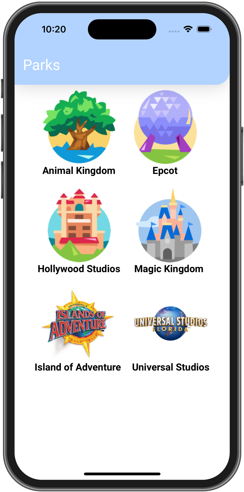
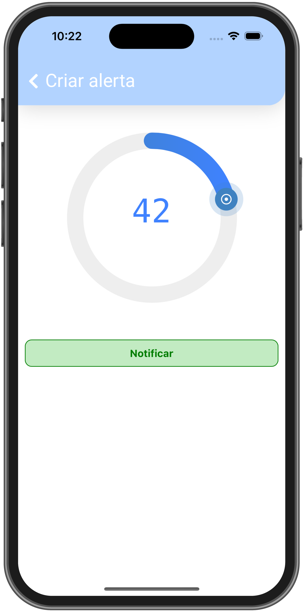

# ParksApp

> :warning: **Status: Development**

## Objective
Develop an app to help plan visits to attractions at Disney parks and Universal Studios in Florida.

The system will use the favorite attractions, the order of priority, queue time, the user's distance to the attraction and if the attraction has already been visited, to create a list in order with the visit recommendations.

## Functional requirements
- Have the main screen with the 6 main parks of Disney and Universal Studios
- The screen for each selected park should show recommended attractions in order
- Must have a **Mark attraction as visited**, **Select attraction** and **Create alert** screen
- A screen to add an alert, for when the attraction takes less than or equal to the planned time
- A screen to organize attractions in order of priority
- Mobile-only layout

## Installation

To be able to start this project, it is necessary to install the dependencies
### `cd frontend && npm install --legacy-peer-deps`

## Run project

### `npm start`

Runs the app in the development mode.\
Open [http://localhost:3000](http://localhost:3000) to view it in the browser.

# Screens

## Home
Show available parks

## Selected park screen

- You can add the park to favorites
- View the user's distance to the attraction
- View queue time
- Check if the attraction has already been visited
- Check if you have an alert activated and the time

## Selected attraction screen

- "Mark as visited" button, so that the system knows that the attraction has already been visited and does not recommend it anymore
- "Select Attraction" Button to Show on iPhone Screen Widget
- "Create alert" button to go to the create alert screen

Screen with "Mark as visited" button selected

## Screen to create an alert

The screen already shows the recommended time, but it is possible to select the time you want.

## Screen to organize the priority order of attractions

You can hold an attraction and reorder them with the priority you want the system to recommend to you.

